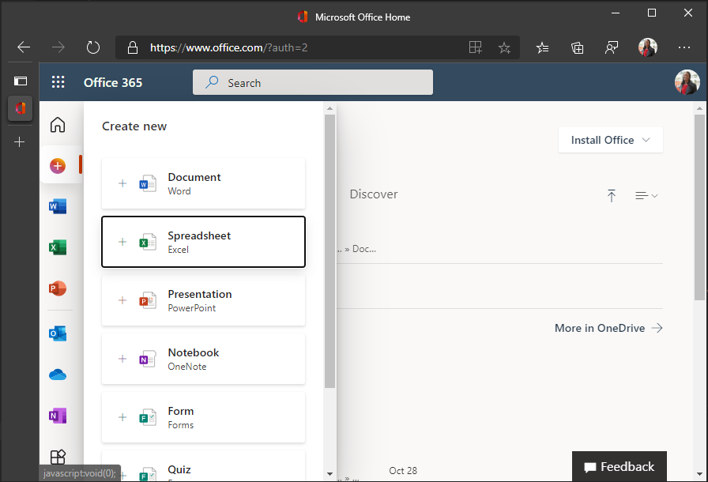

<!-- markdownlint-disable MD002 MD041 -->

<span data-ttu-id="43e01-101">In dieser Übung erstellen Sie mithilfe von [Express](http://expressjs.com/)eine Office-Add-In-Lösung.</span><span class="sxs-lookup"><span data-stu-id="43e01-101">In this exercise you will create an Office Add-in solution using [Express](http://expressjs.com/).</span></span> <span data-ttu-id="43e01-102">Die Lösung besteht aus zwei Teilen.</span><span class="sxs-lookup"><span data-stu-id="43e01-102">The solution will consist of two parts.</span></span>

- <span data-ttu-id="43e01-103">Das Als statische HTML- und JavaScript-Dateien implementierte Add-In.</span><span class="sxs-lookup"><span data-stu-id="43e01-103">The add-in, implemented as static HTML and JavaScript files.</span></span>
- <span data-ttu-id="43e01-104">Ein Node.js/Express-Server, der das Add-In bedient und eine Web-API zum Abrufen von Daten für das Add-In implementiert.</span><span class="sxs-lookup"><span data-stu-id="43e01-104">A Node.js/Express server that serves the add-in and implements a web API to retrieve data for the add-in.</span></span>

## <a name="create-the-server"></a><span data-ttu-id="43e01-105">Erstellen des Servers</span><span class="sxs-lookup"><span data-stu-id="43e01-105">Create the server</span></span>

1. <span data-ttu-id="43e01-106">Öffnen Sie die Befehlszeilenschnittstelle (CLI), navigieren Sie zu einem Verzeichnis, in dem Sie Ihr Projekt erstellen möchten, und führen Sie den folgenden Befehl aus, um eine package.jszu generieren.</span><span class="sxs-lookup"><span data-stu-id="43e01-106">Open your command-line interface (CLI), navigate to a directory where you want to create your project, and run the following command to generate a package.json file.</span></span>

    ```Shell
    yarn init
    ```

    <span data-ttu-id="43e01-107">Geben Sie gegebenenfalls Werte für die Eingabeaufforderungen ein.</span><span class="sxs-lookup"><span data-stu-id="43e01-107">Enter values for the prompts as appropriate.</span></span> <span data-ttu-id="43e01-108">Wenn Sie unsicher sind, sind die Standardwerte in Ordnung.</span><span class="sxs-lookup"><span data-stu-id="43e01-108">If you're unsure, the default values are fine.</span></span>

1. <span data-ttu-id="43e01-109">Führen Sie die folgenden Befehle aus, um Abhängigkeiten zu installieren.</span><span class="sxs-lookup"><span data-stu-id="43e01-109">Run the following commands to install dependencies.</span></span>

    ```Shell
    yarn add express@4.17.1 express-promise-router@4.1.0 dotenv@8.2.0 node-fetch@2.6.1 jsonwebtoken@8.5.1@
    yarn add jwks-rsa@2.0.2 @azure/msal-node@1.0.2 @microsoft/microsoft-graph-client@2.2.1
    yarn add date-fns@2.21.1 date-fns-tz@1.1.4 isomorphic-fetch@3.0.0 windows-iana@5.0.1
    yarn add -D typescript@4.2.4 ts-node@9.1.1 nodemon@2.0.7 @types/node@14.14.41 @types/express@4.17.11
    yarn add -D @types/node-fetch@2.5.10 @types/jsonwebtoken@8.5.1 @types/microsoft-graph@1.35.0
    yarn add -D @types/office-js@1.0.174 @types/jquery@3.5.5 @types/isomorphic-fetch@0.0.35
    ```

1. <span data-ttu-id="43e01-110">Führen Sie den folgenden Befehl aus, um eine tsconfig.jszu generieren.</span><span class="sxs-lookup"><span data-stu-id="43e01-110">Run the following command to generate a tsconfig.json file.</span></span>

    ```Shell
    tsc --init
    ```

1. <span data-ttu-id="43e01-111">Öffnen **Sie ./tsconfig.jsin** einem Texteditor, und nehmen Sie die folgenden Änderungen vor.</span><span class="sxs-lookup"><span data-stu-id="43e01-111">Open **./tsconfig.json** in a text editor and make the following changes.</span></span>

    - <span data-ttu-id="43e01-112">Ändern Sie `target` den Wert in `es6` .</span><span class="sxs-lookup"><span data-stu-id="43e01-112">Change the `target` value to `es6`.</span></span>
    - <span data-ttu-id="43e01-113">Entkomment den `outDir` Wert, und legen Sie ihn auf . `./dist`</span><span class="sxs-lookup"><span data-stu-id="43e01-113">Uncomment the `outDir` value and set it to `./dist`.</span></span>
    - <span data-ttu-id="43e01-114">Entkomment den `rootDir` Wert, und legen Sie ihn auf . `./src`</span><span class="sxs-lookup"><span data-stu-id="43e01-114">Uncomment the `rootDir` value and set it to `./src`.</span></span>

1. <span data-ttu-id="43e01-115">Öffnen **Sie ./package.jsein,** und fügen Sie der JSON die folgende Eigenschaft hinzu.</span><span class="sxs-lookup"><span data-stu-id="43e01-115">Open **./package.json** and add the following property to the JSON.</span></span>

    ```json
    "scripts": {
      "start": "nodemon ./src/server.ts",
      "build": "tsc --project ./"
    },
    ```

1. <span data-ttu-id="43e01-116">Führen Sie den folgenden Befehl aus, um Entwicklungszertifikate für Ihr Add-In zu generieren und zu installieren.</span><span class="sxs-lookup"><span data-stu-id="43e01-116">Run the following command to generate and install development certificates for your add-in.</span></span>

    ```Shell
    npx office-addin-dev-certs install
    ```

    <span data-ttu-id="43e01-117">Wenn Sie zur Bestätigung aufgefordert werden, bestätigen Sie die Aktionen.</span><span class="sxs-lookup"><span data-stu-id="43e01-117">If prompted for confirmation, confirm the actions.</span></span> <span data-ttu-id="43e01-118">Sobald der Befehl abgeschlossen ist, wird die Ausgabe ähnlich der folgenden angezeigt.</span><span class="sxs-lookup"><span data-stu-id="43e01-118">Once the command completes, you will see output similar to the following.</span></span>

    ```Shell
    You now have trusted access to https://localhost.
    Certificate: <path>\localhost.crt
    Key: <path>\localhost.key
    ```

1. <span data-ttu-id="43e01-119">Erstellen Sie eine neue Datei namens **.env** im Stammverzeichnis Ihres Projekts, und fügen Sie den folgenden Code hinzu.</span><span class="sxs-lookup"><span data-stu-id="43e01-119">Create a new file named **.env** in the root of your project and add the following code.</span></span>

    :::code language="ini" source="../demo/graph-tutorial/example.env":::

    <span data-ttu-id="43e01-120">Ersetzen Sie durch den Pfad zu localhost.crt und durch den Pfad zur `PATH_TO_LOCALHOST.CRT` `PATH_TO_LOCALHOST.KEY` localhost.key-Ausgabe durch den vorherigen Befehl.</span><span class="sxs-lookup"><span data-stu-id="43e01-120">Replace `PATH_TO_LOCALHOST.CRT` with the path to localhost.crt and `PATH_TO_LOCALHOST.KEY` with the path to localhost.key output by the previous command.</span></span>

1. <span data-ttu-id="43e01-121">Erstellen Sie ein neues Verzeichnis im Stammverzeichnis Ihres Projekts mit dem Namen **src**.</span><span class="sxs-lookup"><span data-stu-id="43e01-121">Create a new directory in the root of your project named **src**.</span></span>

1. <span data-ttu-id="43e01-122">Erstellen Sie zwei Verzeichnisse im **Verzeichnis ./src:** **addin** und **api**.</span><span class="sxs-lookup"><span data-stu-id="43e01-122">Create two directories in the **./src** directory: **addin** and **api**.</span></span>

1. <span data-ttu-id="43e01-123">Erstellen Sie eine neue Datei mit dem Namen **auth.ts** im **Verzeichnis ./src/api,** und fügen Sie den folgenden Code hinzu.</span><span class="sxs-lookup"><span data-stu-id="43e01-123">Create a new file named **auth.ts** in the **./src/api** directory and add the following code.</span></span>

    ```typescript
    import Router from 'express-promise-router';

    const authRouter = Router();

    // TODO: Implement this router

    export default authRouter;
    ```

1. <span data-ttu-id="43e01-124">Erstellen Sie eine neue Datei mit dem Namen **graph.ts** im **Verzeichnis ./src/api,** und fügen Sie den folgenden Code hinzu.</span><span class="sxs-lookup"><span data-stu-id="43e01-124">Create a new file named **graph.ts** in the **./src/api** directory and add the following code.</span></span>

    ```typescript
    import Router from 'express-promise-router';

    const graphRouter = Router();

    // TODO: Implement this router

    export default graphRouter;
    ```

1. <span data-ttu-id="43e01-125">Erstellen Sie eine neue Datei mit dem Namen **server.ts** im **Verzeichnis ./src,** und fügen Sie den folgenden Code hinzu.</span><span class="sxs-lookup"><span data-stu-id="43e01-125">Create a new file named **server.ts** in the **./src** directory and add the following code.</span></span>

    :::code language="typescript" source="../demo/graph-tutorial/src/server.ts" id="ServerSnippet":::

## <a name="create-the-add-in"></a><span data-ttu-id="43e01-126">Erstellen des Add-Ins</span><span class="sxs-lookup"><span data-stu-id="43e01-126">Create the add-in</span></span>

1. <span data-ttu-id="43e01-127">Erstellen Sie eine neue Datei **namenstaskpane.html** im Verzeichnis **./src/addin,** und fügen Sie den folgenden Code hinzu.</span><span class="sxs-lookup"><span data-stu-id="43e01-127">Create a new file named **taskpane.html** in the **./src/addin** directory and add the following code.</span></span>

    :::code language="html" source="../demo/graph-tutorial/src/addin/taskpane.html" id="TaskPaneHtmlSnippet":::

1. <span data-ttu-id="43e01-128">Erstellen Sie eine neue Datei **mit dem Namen taskpane.css** im **Verzeichnis ./src/addin,** und fügen Sie den folgenden Code hinzu.</span><span class="sxs-lookup"><span data-stu-id="43e01-128">Create a new file named **taskpane.css** in the **./src/addin** directory and add the following code.</span></span>

    :::code language="css" source="../demo/graph-tutorial/src/addin/taskpane.css":::

1. <span data-ttu-id="43e01-129">Erstellen Sie eine neue Datei **namenstaskpane.js** im **Verzeichnis ./src/addin,** und fügen Sie den folgenden Code hinzu.</span><span class="sxs-lookup"><span data-stu-id="43e01-129">Create a new file named **taskpane.js** in the **./src/addin** directory and add the following code.</span></span>

    ```javascript
    // TEMPORARY CODE TO VERIFY ADD-IN LOADS
    'use strict';

    Office.onReady(info => {
      if (info.host === Office.HostType.Excel) {
        $(function() {
          $('p').text('Hello World!!');
        });
      }
    });
    ```

1. <span data-ttu-id="43e01-130">Erstellen Sie ein neues Verzeichnis im **Verzeichnis .src/addin** mit dem Namen **Assets**.</span><span class="sxs-lookup"><span data-stu-id="43e01-130">Create a new directory in the **.src/addin** directory named **assets**.</span></span>

1. <span data-ttu-id="43e01-131">Fügen Sie in diesem Verzeichnis drei PNG-Dateien gemäß der folgenden Tabelle hinzu.</span><span class="sxs-lookup"><span data-stu-id="43e01-131">Add three PNG files in this directory according to the following table.</span></span>

    | <span data-ttu-id="43e01-132">Dateiname</span><span class="sxs-lookup"><span data-stu-id="43e01-132">File name</span></span>   | <span data-ttu-id="43e01-133">Größe in Pixeln</span><span class="sxs-lookup"><span data-stu-id="43e01-133">Size in pixels</span></span> |
    |-------------|----------------|
    | <span data-ttu-id="43e01-134">icon-80.png</span><span class="sxs-lookup"><span data-stu-id="43e01-134">icon-80.png</span></span> | <span data-ttu-id="43e01-135">80x80</span><span class="sxs-lookup"><span data-stu-id="43e01-135">80x80</span></span>          |
    | <span data-ttu-id="43e01-136">icon-32.png</span><span class="sxs-lookup"><span data-stu-id="43e01-136">icon-32.png</span></span> | <span data-ttu-id="43e01-137">32x32</span><span class="sxs-lookup"><span data-stu-id="43e01-137">32x32</span></span>          |
    | <span data-ttu-id="43e01-138">icon-16.png</span><span class="sxs-lookup"><span data-stu-id="43e01-138">icon-16.png</span></span> | <span data-ttu-id="43e01-139">16x16</span><span class="sxs-lookup"><span data-stu-id="43e01-139">16x16</span></span>          |

    > [!NOTE]
    > <span data-ttu-id="43e01-140">Sie können ein beliebiges Bild für diesen Schritt verwenden.</span><span class="sxs-lookup"><span data-stu-id="43e01-140">You can use any image you want for this step.</span></span> <span data-ttu-id="43e01-141">Sie können die in diesem Beispiel verwendeten Bilder auch direkt aus [GitHub herunterladen.](https://github.com/microsoftgraph/msgraph-training-office-addin/demo/graph-tutorial/src/addin/assets)</span><span class="sxs-lookup"><span data-stu-id="43e01-141">You can also download the images used in this sample directly from [GitHub](https://github.com/microsoftgraph/msgraph-training-office-addin/demo/graph-tutorial/src/addin/assets).</span></span>

1. <span data-ttu-id="43e01-142">Erstellen Sie ein neues Verzeichnis im Stammverzeichnis des Projekts namens **Manifest**.</span><span class="sxs-lookup"><span data-stu-id="43e01-142">Create a new directory in the root of the project named **manifest**.</span></span>

1. <span data-ttu-id="43e01-143">Erstellen Sie eine neue Datei **namensmanifest.xml** im Ordner **./manifest,** und fügen Sie den folgenden Code hinzu.</span><span class="sxs-lookup"><span data-stu-id="43e01-143">Create a new file named **manifest.xml** in the **./manifest** folder and add the following code.</span></span> <span data-ttu-id="43e01-144">Ersetzen `NEW_GUID_HERE` Sie durch eine neue GUID, z. `b4fa03b8-1eb6-4e8b-a380-e0476be9e019` B. .</span><span class="sxs-lookup"><span data-stu-id="43e01-144">Replace `NEW_GUID_HERE` with a new GUID, like `b4fa03b8-1eb6-4e8b-a380-e0476be9e019`.</span></span>

    :::code language="xml" source="../demo/graph-tutorial/manifest/manifest.xml":::

## <a name="side-load-the-add-in-in-excel"></a><span data-ttu-id="43e01-145">Seitenladen des Add-Ins in Excel</span><span class="sxs-lookup"><span data-stu-id="43e01-145">Side-load the add-in in Excel</span></span>

1. <span data-ttu-id="43e01-146">Starten Sie den Server, indem Sie den folgenden Befehl ausführen.</span><span class="sxs-lookup"><span data-stu-id="43e01-146">Start the server by running the following command.</span></span>

    ```Shell
    yarn start
    ```

1. <span data-ttu-id="43e01-147">Öffnen Sie Ihren Browser, und navigieren Sie zu `https://localhost:3000/taskpane.html` .</span><span class="sxs-lookup"><span data-stu-id="43e01-147">Open your browser and browse to `https://localhost:3000/taskpane.html`.</span></span> <span data-ttu-id="43e01-148">Es sollte eine Meldung `Not loaded` angezeigt werden.</span><span class="sxs-lookup"><span data-stu-id="43e01-148">You should see a `Not loaded` message.</span></span>

1. <span data-ttu-id="43e01-149">Wechseln Sie in Ihrem Browser [zu Office.com](https://www.office.com/) und melden Sie sich an.</span><span class="sxs-lookup"><span data-stu-id="43e01-149">In your browser, go to [Office.com](https://www.office.com/) and sign in.</span></span> <span data-ttu-id="43e01-150">Wählen **Sie** in der linken Symbolleiste Erstellen aus, und wählen Sie dann **Tabellenkalkulation aus.**</span><span class="sxs-lookup"><span data-stu-id="43e01-150">Select **Create** in the left-hand toolbar, then select **Spreadsheet**.</span></span>

    

1. <span data-ttu-id="43e01-152">Wählen Sie die **Registerkarte** Einfügen und dann **Office-Add-Ins aus.**</span><span class="sxs-lookup"><span data-stu-id="43e01-152">Select the **Insert** tab, then select **Office Add-ins**.</span></span>

1. <span data-ttu-id="43e01-153">Wählen **Sie Mein Add-In hochladen** aus, und wählen Sie dann Durchsuchen **aus.**</span><span class="sxs-lookup"><span data-stu-id="43e01-153">Select **Upload My Add-in**, then select **Browse**.</span></span> <span data-ttu-id="43e01-154">Laden Sie **Die Datei ./manifest/manifest.xml** hoch.</span><span class="sxs-lookup"><span data-stu-id="43e01-154">Upload your **./manifest/manifest.xml** file.</span></span>

1. <span data-ttu-id="43e01-155">Wählen Sie **auf der Registerkarte** Start die Schaltfläche Kalender importieren **aus,** um den Aufgabenfeld zu öffnen.</span><span class="sxs-lookup"><span data-stu-id="43e01-155">Select the **Import Calendar** button on the **Home** tab to open the taskpane.</span></span>

    

1. <span data-ttu-id="43e01-157">Nachdem der Taskpane geöffnet wurde, sollte eine Meldung `Hello World!` angezeigt werden.</span><span class="sxs-lookup"><span data-stu-id="43e01-157">After the taskpane opens, you should see a `Hello World!` message.</span></span>

    
